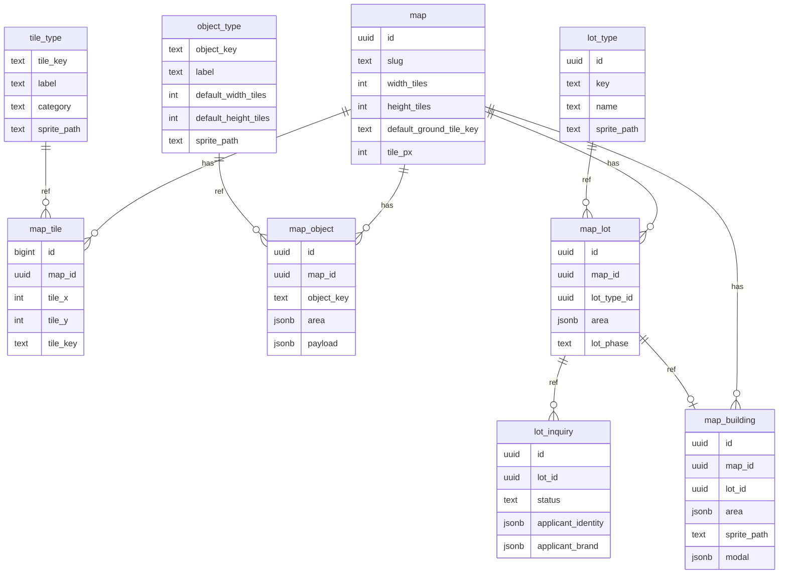

# BPW 맵·부지 DB 명세서 (최종)

**정본:** 맵·부지·에디터 관련 **스키마·겹침·렌더 규칙**의 기준은 본 문서와 `supabase/migrations/`의 타임스탬프 SQL이다. 둘이 어긋나면 **마이그레이션을 우선**하고 본 문서를 맞춘다.

## 0. 문서 목적·범위

**목적**

- 맵 바닥(`map`, `tile_type`, `map_tile`), 배치층 오브젝트(`object_type`, `map_object` — **도로 포함**), 입점 부지(`lot_type`, `map_lot`, `lot_inquiry`), 건물(`map_building`)을 **단일 스키마**로 고정한다.
- 좌표·`area`·`meta`·**`lot_phase`(캐시)**·문의·건물 모달 계약을 **마이그레이션·앱·리뷰**에 그대로 옮길 수 있게 한다.
- **맵 에디터(심시티식 제작)** 의 레이어·겹침·불도저 규칙을 아래 §1과 맞춘다.

**전제**

- **지면(`map_tile`)** 과 그 위 **배치층**(`map_object`·`map_lot`)·**건물** 간 순서는 고정. **`map_object`와 `map_lot`는 동일 시각적 층**으로 두며, **한 타일이 오브젝트 점유와 부지 점유에 동시에 속하지 않는다**(칸 단위 배타).
- 동일 `map_id`에서 **두 `map_building`의 `area`는 교차하지 않는다.** 두 `map_object`의 점유 타일 집합도 교차하지 않는다. 두 `map_lot`의 `area`도 교차하지 않는다.
- 레이어 **내부**는 **`z_order` 없이** 안정 정렬 키로 그린다(§1.9).
- PostgreSQL 기준 **CHECK·FK·부분 유니크** 표기.

**범위 밖**

- 계정·RLS·파일 스토리지·감사 로그 등은 별도 명세.

**저장과 조회**

- 부지·건물·오브젝트는 **직사각형 `area`** 로 한 행에 표현하는 편이 유지보수에 유리하므로, **좌표마다 한 행으로 통합한 단일 테이블**은 쓰지 않는다. 렌더·에디터에서는 필요 시 **조인 또는 클라이언트에서 칸 단위로 합성**한다.

---

## 1. 공통 규칙

### 1.1 좌표계

- 원점 **왼쪽 위**. `tile_x` 증가 = 오른쪽, `tile_y` 증가 = 아래.
- `0 <= tile_x < map.width_tiles`, `0 <= tile_y < map.height_tiles`.
- `map_object.area`, `map_lot.area`, `map_building.area`는 **맵 안에 완전히 포함**. 칸 배타·영역 비교차는 §1.3.

### 1.2 `area` JSON

```json
{ "tile_x": 0, "tile_y": 0, "width_tiles": 2, "height_tiles": 3 }
```

- `width_tiles`, `height_tiles`는 정수 **≥ 1**.
- `map_tile`은 **1칸 = 1행**, `tile_x`·`tile_y`만 사용.

### 1.3 겹침 정책(필수)

- **바닥:** `map_tile`은 `(map_id, tile_x, tile_y)` 유니크로 **한 칸 한 타일**.
- **오브젝트:** 동일 `map_id`에서 두 `map_object`의 점유 타일 집합이 **교차하면 안 됨**(앱·CI 검증).
- **부지:** 동일 `map_id`에서 두 `map_lot`의 `area`가 **교차하면 안 됨**.
- **오브젝트 ↔ 부지:** 동일 `map_id`에서 **한 타일**이 어떤 `map_object`의 점유에도 속하고, 동시에 어떤 `map_lot`의 `area`에도 속하면 안 된다(배치층 내 배타).
- **건물:** 동일 `map_id`에서 두 `map_building`의 `area`(점유 타일 집합)가 **교차하면 안 됨**.

### 1.4 `meta` / `extra` / `modal`

- **`meta`**: `sprite_path` 등 **이미 컬럼으로 뺀 값과 중복 금지**. 부가 정보만.
- **`lot_inquiry.extra`**: 임시·확장 필드.
- **`map_building.modal`**: 클릭 모달 **JSON 계약**(§2.9).

### 1.5 문자열 키·FK

- `tile_type.tile_key`, `object_type.object_key`를 PK로 두고 참조에 **FK** 권장.
- `map.default_ground_tile_key` → `tile_type.tile_key` **FK 권장**(RESTRICT).

### 1.6 타임스탬프

- `timestamptz`, **UTC** 권장. `updated_at` 자동 갱신.

### 1.7 에셋 컬럼명

- 전 테이블 **`sprite_path`** 로 통일 권장(건물 포함).

### 1.8 `tile_px`

- 스키마상 `map.tile_px`는 **NOT NULL**이고 **`> 0`**(CHECK, 마이그레이션 `20260416130000_map_tile_px_not_null.sql` 등). **정사각 타일 한 변의 px**다.
- 클라이언트·에디터는 **로드한 `map` 레코드의 `tile_px`** 를 쓴다. (과거 NULL 허용·앱만의 32px 기본값에 의존하는 경로는 폐지.)

### 1.9 렌더 순서(`z_order` 없음)

**레이어는 고정**(아래 순서가 아래에서 위로).

1. **`map_tile`** + `default_ground_tile_key`로 채운 **지면**.
2. **배치층(동일 시각적 높이):** `map_object` **또는** `map_lot`가 차지하는 타일. 한 칸에는 **둘 중 하나만** 존재(§1.3). 서로 다른 칸에만 동시에 나타날 수 있다. 그릴 때는 구현 일관을 위해 예: **부지 영역 전체 → 오브젝트** 순 등 **한 가지 규칙만** 고정하면 된다.
3. **`map_building`** — 부지 위(일반적으로 해당 `lot_id`의 `area`와 정렬).

**`z_order` 컬럼은 두지 않는다.** 배치층에서 오브젝트와 부지는 **동시에 같은 칸을 쓰지 않으므로** 그 칸에서의 Z 충돌은 없다.

그래도 **항상 같은 그림**을 위해 정렬 키를 고정한다(권장):

- `map_object`: **`ORDER BY area->>'tile_y', area->>'tile_x', id`** (또는 앱에서 파싱 후 `(tile_y, tile_x, id)`).
- `map_lot`: **`ORDER BY area->>'tile_y', area->>'tile_x', id`** 또는 `id`만.
- `map_building`: 오브젝트와 동일 패턴.

(JSON 키 문자열 정렬 주의: 숫자 비교가 필요하면 **생성 컬럼** `anchor_tile_x int` 등을 나중에 추가할 수 있음. 초기에는 앱에서 정수 파싱 후 정렬해도 됨.)

### 1.10 맵 에디터·지면·도로·불도저

- **지면(잔디 등):** `tile_type` / `map_tile`. **브러시·슬라이딩**으로 칸 단위 칠한다.
- **도로:** **`object_type` / `map_object`** 로 둔다(스프라이트는 오브젝트 에셋). 지면 **위**에 올라가며, **불도저로 도로(`map_object`)만 제거**하면 해당 칸의 **`map_tile`은 유지**되어 기존 지면(잔디 등)이 그대로 드러난다.
- **도로 전용 연속 배치(브러시)** 는 일반 오브젝트가 클릭 배치인 것과 달리 **에디터 툴 예외**로 허용할 수 있다.
- **부지:** `map_lot`은 행 하나에 **직사각형 `area`**. 에디터에서 **부지 단위 불도저**는 해당 lot의 **영역 전체**를 없애는 연산(행 삭제 등)으로 맞춘다. **부지 일부만 깎기**는 별도 UX·데이터 규칙이 필요하다.
- **건물:** `map_building`, 부지 위. 배치 전에 **같은 칸에 오브젝트가 있으면 불도저로 치우고**, 부지가 있으면 규칙에 따라 부지를 치운 뒤 배치하는 식의 **상호 배타 규칙**과 조합한다(§1.3).

### 1.11 `lot_phase`와 에디터

- **`lot_phase`** 및 `lot_inquiry`·트리거는 **입점·운영 워크플로**용 **캐시**다. **맵 에디터**의 타일·오브젝트·부지·건물 편집 경로와는 분리해 생각할 수 있다.

---

## 2. 테이블별 상세

각 테이블에서 **`id`·`created_at`·`updated_at`** 는 관례적 컬럼이라 **설명 칸을 비워** 두었다.

---

### 2.1 `map`

| 컬럼                      | 타입          | NULL     | 설명 |
| ------------------------- | ------------- | -------- | ---- |
| `id`                      | `uuid`        | NOT NULL |      |
| `slug`                    | `text`        | NOT NULL | **기계용 고유 키.** URL 경로·REST·번들에서 맵을 가리킬 때 쓰는 짧은 문자열. 사람에게 보이는 제목은 `name`. 테이블 전역 **UNIQUE**. |
| `name`                    | `text`        | NOT NULL | **사람용 표시 이름.** 대시보드·게임 UI 등에 보여 줄 맵 이름. `slug`와 역할이 다름. |
| `width_tiles`             | `int`         | NOT NULL | 맵 **가로 타일 수**. 유효 `tile_x`는 `0 … width_tiles - 1`(§1.1). |
| `height_tiles`            | `int`         | NOT NULL | 맵 **세로 타일 수**. 유효 `tile_y`는 `0 … height_tiles - 1`(§1.1). |
| `default_ground_tile_key` | `text`        | NOT NULL | **`map_tile` 행이 없는 칸**을 채울 때 쓰는 바닥 타일 종류. 반드시 `tile_type.tile_key`에 존재하는 값(FK·RESTRICT). |
| `tile_px`                 | `int`         | NOT NULL | 렌더링 시 **한 칸의 한 변 길이(px)**. 정사각. 스키마상 NOT NULL·**> 0**(§1.8). |
| `created_at`              | `timestamptz` | NOT NULL |      |
| `updated_at`              | `timestamptz` | NOT NULL |      |

**제약:** `width_tiles > 0`, `height_tiles > 0`, `tile_px > 0` (DB CHECK), **`UNIQUE (slug)`**.

**FK:** `default_ground_tile_key` → `tile_type(tile_key)` **ON DELETE RESTRICT**.

**비고:** 맵 단위 메타. 레이어·에디터 UX는 §1.9·§1.10.

---

### 2.2 `tile_type`

| 컬럼          | 타입          | NULL     | 설명 |
| ------------- | ------------- | -------- | ---- |
| `tile_key`    | `text`        | NOT NULL | **바닥 타일 종류 식별자(문자열 PK).** `map_tile.tile_key`·`map.default_ground_tile_key`가 참조. |
| `label`       | `text`        | NOT NULL | 에디터·툴팁 등 **표시용 이름** (예: 잔디, 물). |
| `category`    | `text`        | NOT NULL | 필터·그룹용 **분류** (지형/물 등 팀 규약). |
| `sprite_path` | `text`        | YES      | 해당 타일 **스프라이트 에셋 경로**. |
| `walkable`    | `boolean`     | YES      | 통행 가능 여부. **NULL = 아직 미정.** |
| `meta`        | `jsonb`       | YES      | 부가 정보. §1.4. |
| `created_at`  | `timestamptz` | NOT NULL |      |
| `updated_at`  | `timestamptz` | NOT NULL |      |

**인덱스:** `(category)` 선택.

---

### 2.3 `map_tile`

| 컬럼       | 타입     | NULL     | 설명 |
| ---------- | -------- | -------- | ---- |
| `id`       | `bigint` | NOT NULL |      |
| `map_id`   | `uuid`   | NOT NULL | 이 행이 속한 **맵** (`map.id`). |
| `tile_x`   | `int`    | NOT NULL | 칸 **열** 좌표. 왼쪽 끝이 `0`(§1.1). |
| `tile_y`   | `int`    | NOT NULL | 칸 **행** 좌표. 위쪽 끝이 `0`(§1.1). |
| `tile_key` | `text`   | NOT NULL | 이 칸 **지면 타입** (`tile_type.tile_key`). 잔디·물 타일 등. |

**제약:** **`UNIQUE (map_id, tile_x, tile_y)`**, `tile_x >= 0`, `tile_y >= 0`.

**FK:** `map_id` → `map(id)` **CASCADE**, `tile_key` → `tile_type(tile_key)` **RESTRICT**.

**인덱스:** `(map_id)`.

**비고:** **지면**만 담는다. 도로·나무 등 **배치층**은 `map_object` / `map_lot`(§1.3·§1.10).

---

### 2.4 `object_type`

| 컬럼                   | 타입          | NULL     | 설명 |
| ---------------------- | ------------- | -------- | ---- |
| `object_key`           | `text`        | NOT NULL | **배치 오브젝트 종류 ID (문자열 PK).** 나무·도로 등. `map_object.object_key`가 참조. |
| `label`                | `text`        | NOT NULL | 에디터·목록 **표시 이름**. |
| `default_width_tiles`  | `int`         | NOT NULL | 새로 배치할 때 **기본 가로 칸 수** (`area` 기본값에 사용). |
| `default_height_tiles` | `int`         | NOT NULL | 새로 배치할 때 **기본 세로 칸 수**. |
| `sprite_path`          | `text`        | NOT NULL | 해당 타입 **스프라이트** 경로. |
| `meta`                 | `jsonb`       | YES      | 부가 정보. |
| `created_at`           | `timestamptz` | NOT NULL |      |
| `updated_at`           | `timestamptz` | NOT NULL |      |

**제약:** `default_width_tiles > 0`, `default_height_tiles > 0`.

**비고:** **도로** 타입도 여기서 정의하고 `map_object`로 배치한다(§1.10).

---

### 2.5 `map_object`

| 컬럼         | 타입          | NULL     | 설명 |
| ------------ | ------------- | -------- | ---- |
| `id`         | `uuid`        | NOT NULL |      |
| `map_id`     | `uuid`        | NOT NULL | 소속 **맵**. |
| `object_key` | `text`        | NOT NULL | **종류** (`object_type`). 도로도 동일하게 여기서 구분. |
| `area`       | `jsonb`       | NOT NULL | 맵 위 **직사각형 점유** (§1.2). 배치층: 부지와 칸 배타(§1.3). |
| `payload`    | `jsonb`       | YES      | 회전·추가 상태 등 **타입별 확장** (선택). |
| `created_at` | `timestamptz` | NOT NULL |      |
| `updated_at` | `timestamptz` | NOT NULL |      |

**`z_order` 없음** — §1.9.

**FK:** `map_id` → `map(id)` **CASCADE**, `object_key` → `object_type(object_key)` **RESTRICT**.

**인덱스:** `(map_id)`.

**비고:** 두 오브젝트 간 타일 겹침 금지·**부지와의 칸 배타**는 **앱·검증**으로 강제(§1.3). **도로**는 `object_type`/`map_object`로 두며 에디터·불도저 규칙은 §1.10.

---

### 2.6 `lot_type`

| 컬럼          | 타입          | NULL     | 설명 |
| ------------- | ------------- | -------- | ---- |
| `id`          | `uuid`        | NOT NULL |      |
| `key`         | `text`        | NOT NULL | **부지 종류 코드** (설정·스크립트용). 사람용 이름은 `name`. **UNIQUE.** |
| `name`        | `text`        | NOT NULL | **표시 이름** (대시보드·UI). `key`와 역할이 다름. |
| `sprite_path` | `text`        | NOT NULL | 타입별 **대표 스프라이트**. 실제 맵에서 덮이는 크기는 **`map_lot.area`** 가 결정. |
| `meta`        | `jsonb`       | YES      | 부가 정보. |
| `created_at`  | `timestamptz` | NOT NULL |      |
| `updated_at`  | `timestamptz` | NOT NULL |      |

**제약:** `UNIQUE (key)`.

---

### 2.7 `map_lot`

| 컬럼          | 타입          | NULL     | 설명 |
| ------------- | ------------- | -------- | ---- |
| `id`          | `uuid`        | NOT NULL |      |
| `map_id`      | `uuid`        | NOT NULL | 소속 **맵**. |
| `lot_type_id` | `uuid`        | NOT NULL | **부지 종류** (`lot_type`). |
| `area`        | `jsonb`       | NOT NULL | 맵 위 **직사각형 부지** (§1.2). 행 하나가 영역 전체. |
| `lot_phase`   | `text`        | NOT NULL | 입점 단계 **캐시** (§3). `lot_inquiry`·`map_building` 변경 시 트리거 등으로 갱신. |
| `created_at`  | `timestamptz` | NOT NULL |      |
| `updated_at`  | `timestamptz` | NOT NULL |      |

**제약:** `lot_phase IN ('vacant','contact','construction','built')`.

**FK:** `map_id` → `map(id)` **CASCADE**, `lot_type_id` → `lot_type(id)` **RESTRICT**.

**인덱스:** `(map_id)`, 선택 `(map_id, lot_phase)`.

**비고:** `inquiry` / `display` / `sort_order` **없음**. 목록 정렬은 `id` 또는 `area` 기준 좌표. 부지는 **연결된 직사각형 `area`** 한 덩어리; 에디터에서 **부지 단위 불도저** 시 해당 `map_lot` 행 전체를 다루면 된다(§1.10). **오브젝트와의 칸 배타**는 §1.3.

---

### 2.8 `lot_inquiry`

| 컬럼                 | 타입          | NULL     | 설명 |
| -------------------- | ------------- | -------- | ---- |
| `id`                 | `uuid`        | NOT NULL |      |
| `lot_id`             | `uuid`        | NOT NULL | 문의 대상 **부지** (`map_lot.id`). |
| `contact_email`      | `text`        | NOT NULL | 회신·연락용 **이메일** (필수). |
| `phone_number`       | `text`        | YES      | **전화번호** (선택). |
| `message`            | `text`        | YES      | 신청자 **메모·메시지** (선택). |
| `applicant_identity` | `jsonb`       | NOT NULL | 신청 주체 식별 **JSON** (필드 계약은 팀 고정). |
| `applicant_brand`    | `jsonb`       | YES      | 입점 브랜드 **JSON** (선택). |
| `status`             | `text`        | NOT NULL | **`pending`** 접수 / **`selected`** 선정 / **`rejected`** 거절. §3 `lot_phase`와 연동. |
| `extra`              | `jsonb`       | YES      | 임시·확장 필드. |
| `created_at`         | `timestamptz` | NOT NULL |      |
| `updated_at`         | `timestamptz` | NOT NULL |      |

**제약:** `status`는 위 **세 값만** 허용(CHECK).

**부분 유니크:** 동일 `lot_id`에 `status = 'selected'` **최대 1건**.

**FK:** `lot_id` → `map_lot(id)` — 정책에 따라 **CASCADE** 또는 이력 보존 시 별도.

**인덱스:** `(lot_id)`, `(status)`.

---

### 2.9 `map_building`

| 컬럼          | 타입          | NULL          | 설명 |
| ------------- | ------------- | ------------- | ---- |
| `id`          | `uuid`        | NOT NULL      |      |
| `map_id`      | `uuid`        | NOT NULL      | 소속 **맵**. |
| `lot_id`      | `uuid`        | NOT NULL 권장 | 연결 **부지** (`map_lot`). 부지당 건물 1개 정책이면 **`UNIQUE (lot_id)`**. |
| `label`       | `text`        | YES           | 맵·모달에서 쓸 **짧은 이름** (선택). |
| `area`        | `jsonb`       | NOT NULL      | 건물이 차지하는 **직사각형** (§1.2). 타 건물 `area`와 교차 불가(§1.3). |
| `sprite_path` | `text`        | YES           | 건물 **스프라이트** (선택). |
| `modal`       | `jsonb`       | YES           | 클릭 시 모달 **페이로드** (하단 계약). |
| `created_at`  | `timestamptz` | NOT NULL      |      |
| `updated_at`  | `timestamptz` | NOT NULL      |      |

**`z_order` 없음** — §1.9.

**건물 `area`:** 동일 `map_id`에서 서로 **교차 불가**(§1.3).

**FK:** `map_id` → `map(id)` **CASCADE**, `lot_id` → `map_lot(id)` **CASCADE** 또는 **RESTRICT**.

**인덱스:** `(map_id)`, `(lot_id)`.

**`modal` 계약:** `images[]` (`url`, `alt`, `sort`), `title`, `body`, 선택 `cta` `{ label, href }`.

**비고:** 렌더 순서 §1.9. **동일 `map_id`에서 다른 건물의 `area`와 교차 불가**(§1.3). 부지와의 관계는 `lot_id`·FK.

---

## 3. `lot_phase` 동기화

**의미:** `map_lot.lot_phase`는 **입점·운영 워크플로**를 위한 **캐시**다(§1.11). 맵 에디터가 필수로 건드릴 값은 아니다.

**재계산 우선순위(한 부지에 적용할 단계 하나만 선택):** 아래를 **위에서부터** 만족하는 첫 값이 된다. (마이그레이션의 `bpw_refresh_map_lot_phase`와 동일.)

1. 해당 `lot_id`에 **`map_building` 행이 있으면** → `built`
2. 아니고 `lot_inquiry` 중 **`status = 'selected'`** 가 있으면 → `construction`
3. 아니고 **`status = 'pending'`** 이 있으면 → `contact`
4. 그 외 → `vacant`

**갱신 시점:** `map_building`·`lot_inquiry` INSERT/UPDATE/DELETE 시 해당 `map_lot`에 재계산 저장. DB **트리거**(`trg_map_building_phase`, `trg_lot_inquiry_phase`) 또는 동일 규칙의 앱 서비스.

**참고:** `pending`/`selected`가 없고 `rejected` 등만 남은 경우는 위 분기에 걸리지 않아 **`vacant`** 에 가깝게 수렴한다(함수 `ELSE` 분기).

---

## 4. FK·ON DELETE 요약

| 자식           | 부모          | 권장                  |
| -------------- | ------------- | --------------------- |
| `map_tile`     | `map`         | CASCADE               |
| `map_tile`     | `tile_type`   | RESTRICT              |
| `map_object`   | `map`         | CASCADE               |
| `map_object`   | `object_type` | RESTRICT              |
| `map_lot`      | `map`         | CASCADE               |
| `map_lot`      | `lot_type`    | RESTRICT              |
| `lot_inquiry`  | `map_lot`     | CASCADE 등 정책       |
| `map_building` | `map`         | CASCADE               |
| `map_building` | `map_lot`     | CASCADE 또는 RESTRICT |
| `map`          | `tile_type`   | RESTRICT              |

**논리 제약(FK 아님):** `map_object`와 `map_lot`의 **칸 단위 배타**, 건물·오브젝트·부지 **영역 비교차**는 §1.3 — **앱·검증·에디터**로 강제한다.

---

## 5. 마이그레이션 순서

스키마의 **실행 순서**는 레포 `supabase/migrations/`에 따른다. 아래는 **의존 관계 요약**이다.

1. `tile_type`
2. `map`
3. `map_tile`
4. `object_type` → `map_object`
5. `lot_type` → `map_lot`
6. `lot_inquiry`
7. `map_building`
8. `lot_phase` 함수·트리거
9. (선택) 공통 `updated_at` 트리거

---

## 6. Mermaid ER

FK 관계만 표시한다. **`map_object`와 `map_lot`는 동일 배치층·칸 배타**(§1.3)이나 ER로는 나타나지 않는다.


